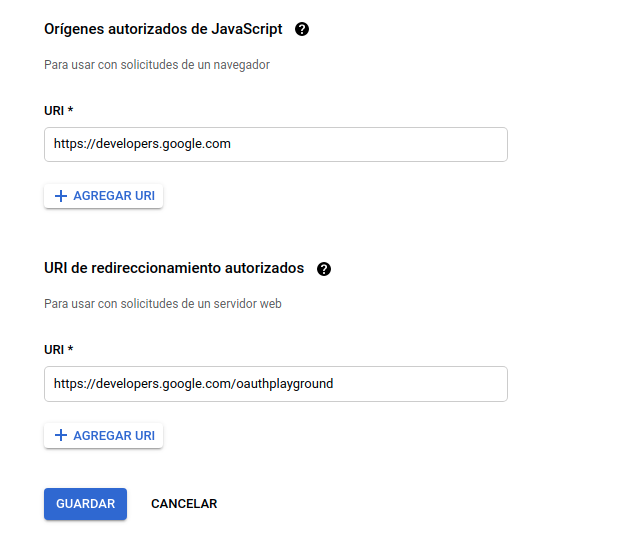

# quotemark-server
Simple Node.js server to handle or manage quotes stored by users while navigating online

## Installation

### Database

1. To run migrations a **knexfile** is needed, to create one you can run the command:
```
npm run knext:init
```

2. After that you must fill the attributes on the connection object depending on the DBMS you use

```javascript
{
  client: 'mysql',
  connection: {
    host: '<host>',
    user: '<user>',
    password: '<password>',
    database: '<database>',
  },
  migrations: {
    tableName: 'knex_migrations',
    extension: 'ts',
  }
}
```

3. Once configured, you can run the migrations
```
npm run migrate:latest
```

### Authentication
To use GraphQLi and run tests you need to set a refresh token, to do so you can follow this steps:

1. Create a Google Cloud Project and create OAuth2 credentials for a web aplication.

2. Set [https://developers.google.com](https://developers.google.com) as the authorized origin to make requests from

3. Set [https://developers.google.com/oauthplayground](https://developers.google.com/oauthplayground) as the route to go after authorization



4. Save the changes and set the **GOOGLE_AUTH_CLIENT_ID** and **GOOGLE_AUTH_CLIENT_SECRET** environment variables to the values given by Google.

5. Finally go to [https://developers.google.com/oauthplayground](https://developers.google.com/oauthplayground), and use the client id and client secret to get access to this scopes:
    * https://www.googleapis.com/auth/userinfo.email
    * https://www.googleapis.com/auth/userinfo.profile
    * https://www.googleapis.com/auth/user.birthday.read

6. Once you get the *refresh_token* from the playground you can set that value on the environment variable **GOOGLE_AUTH_REFRESH_TOKEN** and start using the api.